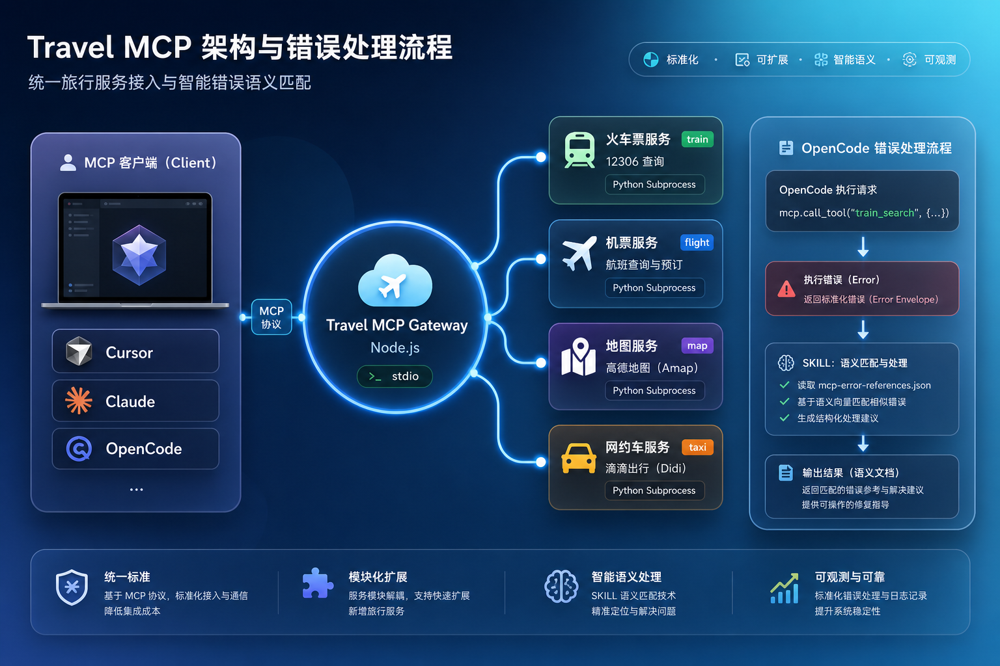

# Agent Installation Guide

This guide is for LLM agents. The goal is to install dependencies, configure environment files, build the Travel MCP Gateway, and prepare MCP client configuration for the user.



## Questions for the user

Ask for everything below **before** making changes. **Never paste live secrets** into chat. Do **not** commit `.env`, logs, or machine-local paths.

### MCP host (pick one before configuring clients)

Ask where this MCP will run:

- **OpenCode** / **Cursor** / **Claude Code** / **Other**
- If **Other**: capture the **exact product name**, fetch its official MCP configuration docs (paths, root JSON keys, stdio command shape), then author config—**never guess** incompatible keys (for example, do not paste OpenCode `environment` into hosts that only accept `mcpServers[].env`).

### Runtimes (guide installs when missing)

1. **Node.js and npm**: From the repo root, try `node --version` and `npm --version`. If either fails, ask the user to install **Node.js LTS** from **[https://nodejs.org/](https://nodejs.org/)** (npm ships with it), then **restart the terminal** and re-run these checks.
2. **Python**: Try `python --version`, `python3 --version`, or on Windows `py -V`. If unavailable, ask the user to install Python from **[https://www.python.org/downloads/](https://www.python.org/downloads/)** (enable **Add python.exe to PATH** on Windows), restart the terminal, and verify again.

### Python dependency tooling

3. **Prefer uv**: Recommend **[uv](https://docs.astral.sh/uv/)** for the `FlightTicketMCP` virtual environment—it resolves installs quickly and keeps environments reproducible. Help install uv if needed; otherwise fall back to `pip install -r requirements.txt` or `pip install -e .`.

### API keys (help users obtain keys when absent)

4. **`AMAP_MAPS_API_KEY` (Amap maps MCP)**: If missing, point users to **[Amap MCP Server overview](https://lbs.amap.com/api/mcp-server/summary)**. Reference walk-through video (Chinese): [Bilibili · Amap MCP (BV1qwZqYJEUG)](https://www.bilibili.com/video/BV1qwZqYJEUG/).
5. **`DIDI_MCP_KEY` (DiDi MCP)**: If missing, point users to **[DiDi MCP](https://mcp.didichuxing.com/)**. Reference walk-through video (Chinese): [Bilibili · DiDi MCP (BV1vpb7zaECv)](https://www.bilibili.com/video/BV1vpb7zaECv/).
6. **`VARIFLIGHT_API_KEY` (optional flight fallback)**: If VariFlight fallback is desired but no key exists, ask users to apply via **[VariFlight MCP](https://mcp.variflight.com/)**. Leaving it unset still allows the Ctrip-first path described in FlightTicketMCP.

## 1. Check the runtime

Run these commands from the repository root:

```bash
node --version
npm --version
python --version
```

If the user wants `uv`:

```bash
uv --version
```

If Node.js, npm, or Python is missing, **do not guess paths**: follow the installation guidance in **Questions for the user**, ask the user to restart the terminal, then rerun this section’s checks.

## 2. Install root dependencies

```bash
npm install
```

## 3. Install flight provider dependencies

Stay aligned with **Prefer uv** above: **try uv first**; fall back to pip only when the user insists.

```bash
cd FlightTicketMCP
uv venv
uv pip install -r requirements.txt
cd ..
```

If `uv` is unavailable, use `pip`:

```bash
cd FlightTicketMCP
pip install -r requirements.txt
cd ..
```

Depending on the user's Python environment, this is also valid:

```bash
cd FlightTicketMCP
pip install -e .
cd ..
```

## 4. Create environment files

Create the root `.env` from the template:

Windows PowerShell:

```powershell
Copy-Item .env.example .env
```

macOS / Linux:

```bash
cp .env.example .env
```

Then write the user's real values to `.env`:

```dotenv
AMAP_MAPS_API_KEY=user_amap_key
DIDI_MCP_KEY=user_didi_key

# Optional overrides
TRAIN_12306_ENTRY=./12306-mcp/build/index.js
FLIGHT_MCP_PROJECT_ROOT=./FlightTicketMCP
FLIGHT_MCP_PYTHON_COMMAND=python
```

The optional flight fallback is configured in `FlightTicketMCP/.env`. If the user provides `VARIFLIGHT_API_KEY`, copy the template:

Windows PowerShell:

```powershell
Copy-Item FlightTicketMCP/.env.example FlightTicketMCP/.env
```

macOS / Linux:

```bash
cp FlightTicketMCP/.env.example FlightTicketMCP/.env
```

Then set:

```dotenv
VARIFLIGHT_API_KEY=user_variflight_key
```

If the user does not have a VariFlight key, leave it unset. Flight search tries Ctrip web flight listings first.

## 5. Build and verify

```bash
npm run build
```

Verify that the server entrypoint starts:

```bash
node build/index.js
```

This is a stdio MCP server. During manual verification it may wait for MCP client messages; the important part is that it does not immediately fail because of missing dependencies, syntax errors, or environment-loading errors.

## 6. MCP client configuration

After §5, branch on the **MCP host** answer. **OpenCode** uses `mcp.*` with `environment` and `command` as a string array; **Cursor** and **Claude Code** project `.mcp.json` typically use **`mcpServers` + `env`**—do not mix schemas.

Copy-ready placeholders live under **[docs/mcp-client-examples/](mcp-client-examples/)** (see `mcp-client-examples/README.md` for the index and canonical doc links).

### 6.1 Shared rules

- The gateway is a **stdio** server: `node` + `build/index.js`.
- Keep env names aligned with `.env` / host injection: `AMAP_MAPS_API_KEY`, `DIDI_MCP_KEY`, `FLIGHT_MCP_PYTHON_COMMAND`; optional `TRAIN_12306_ENTRY`, `FLIGHT_MCP_PROJECT_ROOT` (see [.env.example](../.env.example)).
- If the host **cwd is not the repo root**, switch `./build/index.js` (and `./12306-mcp`, `./FlightTicketMCP`) to **absolute paths**.

### 6.2 Cursor

1. Read [Cursor · MCP](https://cursor.com/docs/context/mcp).
2. Use [cursor.mcp.json.example](mcp-client-examples/cursor.mcp.json.example) to create or merge **`.cursor/mcp.json`** at the project root (and/or merge user-global config per docs).
3. Replace placeholders (or load secrets from host storage); restart/reload MCP per Cursor guidance.

### 6.3 Claude Code

1. Read [Connect Claude Code to tools via MCP](https://docs.claude.com/en/docs/claude-code/mcp.md).
2. Copy [claude-code.mcp.json.example](mcp-client-examples/claude-code.mcp.json.example) to repo-root **`.mcp.json`**, or run `claude mcp add --transport stdio ... --scope project` (sample command in [mcp-client-examples/README.md](mcp-client-examples/README.md)).
3. Respect approval flows and `--` option ordering from the docs.
4. Replace placeholders like §6.2.

### 6.4 OpenCode

1. OpenCode **does not** use the Desktop-style root **`mcpServers`** block. Use **`mcp.<serverId>`** with **`environment`** (not `env`) and **`command`** as a **string array**—see [.opencode/opencode.json](../.opencode/opencode.json).
2. Merge [opencode.mcp.fragment.json](mcp-client-examples/opencode.mcp.fragment.json) under the user’s **`mcp` object**.
3. Optionally set `$schema` to `https://opencode.ai/config.json`. Replace placeholders like §6.2.

### 6.5 Other hosts

1. Search official docs using the **exact product name** the user provided.
2. Verify config path, root JSON shape, and stdio fields before editing files.
3. Deliver minimal working snippets for the user to paste locally—never commit live secrets to this repo.

## 7. Troubleshooting

For MCP connection, authentication, schema, or response-format issues:

1. Check that `.env` and the client config use the same variable names.
2. Check that `npm run build` succeeds.
3. Check that `FlightTicketMCP` dependencies are installed.
4. For Amap, DiDi, and VariFlight key issues, consult `.opencode/skills/error-processing/mcp-error-references.json`.
5. Never print full environment dumps, tokens, real secrets, or private account data.
