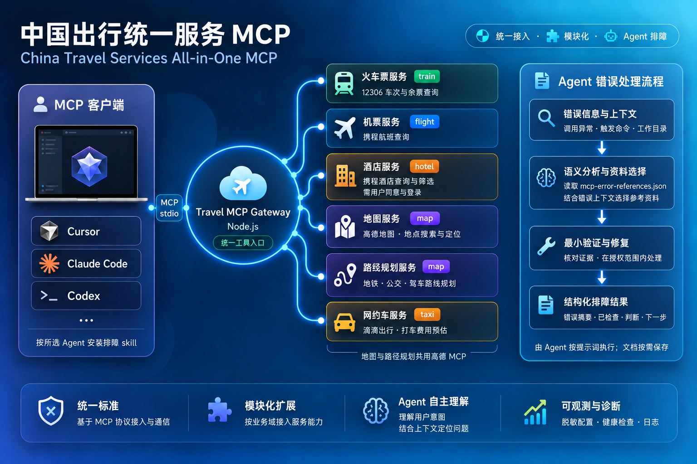

# Agent 安装指南

本文写给 LLM Agent。目标是在本地完成 Travel MCP Gateway 的依赖安装、环境配置、构建验证，并给用户生成可复制到 MCP 客户端的配置。



## 给用户的确认问题

开始前向用户确认以下信息。**不要在回复中打印真实密钥；不要提交 `.env`、日志或本机绝对路径。**

### MCP 宿主应用（必须先确认）

在开始安装前，确认用户将在何种应用中启用本 MCP（§6 将按该项分支编写配置）：

- **OpenCode** / **Cursor** / **Claude Code** / **其它**
- 若选 **其它**：请用户提供 **准确产品名称**。你必须检索该产品 **官方 MCP 配置文档**（配置文件路径、根字段名、`stdio` 的 `command`/`args` 形态等），再生成配置；**禁止臆测**（例如勿把 OpenCode 的 `environment`/`command` 数组写入仅支持 `mcpServers` + `env` 的宿主）。

### 运行时（缺失时请引导官方安装）

1. **Node.js 与 npm**：请在仓库根目录尝试 `node --version`、`npm --version`。若命令不存在或报错，引导用户从 **[Node.js 官网](https://nodejs.org/)** 下载并安装 **LTS**（安装程序自带 npm）；安装完成后建议 **重新打开终端** 再验证。
2. **Python**：尝试 `python --version`（部分环境为 `py -V` 或 `python3 --version`）。若不可用，引导用户从 **[Python 官网](https://www.python.org/downloads/)** 下载安装包；Windows 安装时建议勾选 **Add python.exe to PATH**，完成后重新打开终端再验证。

### Python 依赖安装方式

3. **优先建议使用 uv**：推荐通过 **[uv](https://docs.astral.sh/uv/)** 为 `FlightTicketMCP` 创建虚拟环境并安装依赖（解析与安装速度快、环境更易复现）。若用户尚未安装 uv，可协助其按官方文档安装；若用户坚持使用传统方式，则改用 `pip install -r requirements.txt` 或 `pip install -e .`。

### API Key（用户暂未持有时请引导申请）

4. **`AMAP_MAPS_API_KEY`（高德地图 MCP）**：若用户暂无密钥，引导其在 **[高德 MCP Server 概述](https://lbs.amap.com/api/mcp-server/summary)** 按官方流程申请与配置。可让其参考讲解视频：[哔哩哔哩 · 高德 MCP（BV1qwZqYJEUG）](https://www.bilibili.com/video/BV1qwZqYJEUG/)。
5. **`DIDI_MCP_KEY`（滴滴出行 MCP）**：若用户暂无密钥，引导其在 **[滴滴 MCP 开放平台](https://mcp.didichuxing.com/)** 申请。可让其参考讲解视频：[哔哩哔哩 · 滴滴出行 MCP（BV1vpb7zaECv）](https://www.bilibili.com/video/BV1vpb7zaECv/)。
6. **浏览器内核（航班抓取）**：携程反爬 WAF 需要可见浏览器，安装时让用户在 **A = Edge（默认）/ B = Chrome** 中选择，或提供自定义浏览器路径（见 §4.1 的 C 项）。
7. **酒店搜索风险同意（重要）**：酒店搜索需要携程登录态并模拟真人浏览，存在账号封禁风险。必须让用户明确选择是否启用（见 §4.1 的 D 项）；**选择启用即表示用户自愿承担风险，作者概不负责**。

## 1. 检查运行环境

在仓库根目录运行：

```bash
node --version
npm --version
python --version
```

如果用户希望使用 `uv`：

```bash
uv --version
```

缺少 Node.js、npm 或 Python 时，**勿猜测安装路径**：请先完成上文「给用户的确认问题」中的官方安装指引，让用户重新打开终端后，再重复本节命令验证。

## 2. 安装根项目依赖

```bash
npm install
```

## 3. 安装航班和酒店 Python 依赖

两个 Python provider 使用仓库根目录 `.venv`，Python 需 3.11+。已有可用环境时直接复用；否则在仓库根目录创建：

```sh
uv venv .venv --python 3.11
```

Windows PowerShell:

```powershell
uv pip install --python .venv/Scripts/python.exe -e "./FlightTicketMCP[dev]" -e "./HotelTicketMCP[dev]"
```

macOS / Linux:

```sh
uv pip install --python .venv/bin/python -e "./FlightTicketMCP[dev]" -e "./HotelTicketMCP[dev]"
```

## 3.5 安装并构建 12306-mcp 子项目

> ⚠️ **已知问题**：12306-mcp 的 `npm run build` 通过 `run-script-os` 执行 OS 特定预构建脚本。Windows 上 `prebuild:win32` 运行 `del /q /s build\* >nul 2>&1`，当 `build/` 目录不存在（如首次构建）时可能因无匹配文件而返回非零退出码，导致后续 `tsc` 步骤被跳过。
> **解决方案**：直接使用 `npx tsc` 构建，并确保 `build/` 目录存在。

```bash
cd 12306-mcp
npm install
# 确保 build 目录存在后再运行 tsc
if (!(Test-Path build)) { New-Item -ItemType Directory -Path build | Out-Null }
npx tsc
cd ..
```

macOS / Linux 下若 npm run build 正常则无需额外处理，但若遇到同样问题可手动运行：

```bash
cd 12306-mcp
npm install
mkdir -p build
npx tsc
cd ..
```

## 4. 收集 API Key 并生成环境变量文件

> **必须交互式收集 Key**：**不要直接中断**等用户自行填写——先通过 `question` 工具逐项向用户收集，缺 Key 时引导申请链接。收集完成后写入 `.env`。两个 Key 均收集完成前，不要进入 §8 功能测试（否则 map/taxi 域会因 Key 为空而 FAIL）。

### 4.1 交互式收集 Key

按以下顺序使用 `question` 工具询问用户：

> **`question` 工具约束**：一次调用最多 4 个问题；**每个问题至少 2 个选项**（单选项问题会被整体拒绝，不要构造单选项问题，也不要凑数选项）；**所有提问必须用中文**。密钥属于自由文本，请让用户通过问题自带的 **Other** 选项输入；收到密钥后写入 `.env`，**不要在回复中回显真实密钥**。

**A. AMAP Maps API Key（高德地图）**

```
question: "你有高德地图 MCP 的 API Key 吗？（如有 Key，请选择 Other 并粘贴密钥；⚠ 不要粘贴在聊天里）"
选项: 
  - "我有 Key，我会输入" → 用户输入值后，你将该值写入 .env 的 AMAP_MAPS_API_KEY
  - "我没有 Key，需要申请" → 输出申请链接：
    - 官方：https://lbs.amap.com/api/mcp-server/summary
    - 视频教程：https://www.bilibili.com/video/BV1qwZqYJEUG/
    - 等用户拿到 Key 后继续
```

**B. DIDI MCP Key（滴滴出行）**

```
question: "你有滴滴出行 MCP 的 API Key 吗？（如有 Key，请选择 Other 并粘贴密钥；⚠ 不要粘贴在聊天里）"
选项:
  - "我有 Key，我会输入" → 用户输入值后，你将该值写入 .env 的 DIDI_MCP_KEY
  - "我没有 Key，需要申请" → 输出申请链接：
    - 官方：https://mcp.didichuxing.com/
    - 视频教程：https://www.bilibili.com/video/BV1vpb7zaECv/
    - 等用户拿到 Key 后继续
```

**C. 浏览器内核选择（航班+酒店抓取共用，A/B）**

```
question: "选择航班/酒店抓取使用的浏览器内核？（携程反爬需要可见浏览器；航班与酒店共用该选择）"
选项:
  - "A. Edge（默认，Windows 自带即可）" → 写入 FLIGHT_MCP_BROWSER=edge 与 HOTEL_MCP_BROWSER=edge
  - "B. Chrome" → 写入 FLIGHT_MCP_BROWSER=chrome 与 HOTEL_MCP_BROWSER=chrome
  - "自定义路径" → 写入 FLIGHT_MCP_BROWSER_PATH 与 HOTEL_MCP_BROWSER_PATH=<浏览器绝对路径>
说明: 查询时会以最小化窗口打开浏览器（任务栏可见，不抢前台）；无头模式会被携程拦截，默认不启用。
```

**D. 酒店搜索风险同意（重要，必须询问）**

```
question: "是否启用携程酒店搜索（hotel 域）？⚠ 该功能通过浏览器模拟真人浏览并抓取需要登录的携程酒店数据，存在账号被封禁的风险。选择启用即表示你已了解并自愿承担该风险，作者概不负责。"
选项:
  - "启用，我自愿承担风险" → 写入 HOTEL_MCP_CONSENT=yes
  - "不启用" → 不写入 HOTEL_MCP_CONSENT（或写入 no），酒店工具调用时返回 CONSENT_REQUIRED 错误
说明: 两次酒店搜索之间会自动等待随机 30s~5min；搜索返回 LOGIN_REQUIRED 时调用 hotel_ctrip_login，先通过 MCP 原生提问让用户选择是否打开登录页。若返回 USER_INTERACTION_REQUIRED，必须调用 AskUserQuestion 或宿主的原生提问工具，并等待实际回答后传入 user_action。详见 [酒店登录交互](hotel-login.md)。
```

### 4.2 生成 .env 文件

收集完所有 Key 后，再从模板生成并填入真实值：

从模板生成根目录 `.env`：

Windows PowerShell：

```powershell
Copy-Item .env.example .env
```

macOS / Linux：

```bash
cp .env.example .env
```

然后把用户提供的真实值写入 `.env`：

```dotenv
AMAP_MAPS_API_KEY=用户提供的高德Key
DIDI_MCP_KEY=用户提供的滴滴Key

# Optional overrides
TRAIN_12306_ENTRY=./12306-mcp/build/index.js
FLIGHT_MCP_PROJECT_ROOT=./FlightTicketMCP
# FLIGHT_MCP_PYTHON_COMMAND=/absolute/path/to/python
# 浏览器内核：A=edge（默认）/ B=chrome（航班与酒店共用）
FLIGHT_MCP_BROWSER=edge
HOTEL_MCP_PROJECT_ROOT=./HotelTicketMCP
# HOTEL_MCP_PYTHON_COMMAND=/absolute/path/to/python
HOTEL_MCP_BROWSER=edge
# 自定义浏览器路径（可选，优先于 FLIGHT_MCP_BROWSER / HOTEL_MCP_BROWSER）
# FLIGHT_MCP_BROWSER_PATH=/absolute/path/to/msedge.exe
# HOTEL_MCP_BROWSER_PATH=/absolute/path/to/msedge.exe
# 无头模式（不推荐：会被携程 whaleguard 拦截）
# FLIGHT_MCP_HEADLESS=1
# HOTEL_MCP_HEADLESS=1
# ⚠ 酒店搜索风险同意（仅在 §4.1 D 项用户选择"启用"时取消注释并写 yes；不启用则整个 hotel 域不可用）
# HOTEL_MCP_CONSENT=yes
# 两次酒店搜索之间的随机间隔范围（秒，默认 30~300）
# HOTEL_MCP_MIN_DELAY=30
# HOTEL_MCP_MAX_DELAY=300
```

> 项目目录/火车入口相对仓库解析，解释器路径相对 provider 目录解析。Windows 使用 `.venv/Scripts/python.exe`；macOS/Linux 使用 `.venv/bin/python`。显式配置推荐绝对路径。

> **安全警告**：**永远不要在回复中打印真实密钥**；不要提交 `.env` 到 git；写文件后立刻验证 `.env` 是否在 `.gitignore` 中。

## 5. 构建根网关并验证

```bash
npm run build
```

验证服务入口存在（确认 12306-mcp 也已构建，见 §3.5）：

```bash
node build/index.js
```

这是 stdio MCP 服务。启动后通常会等待 MCP 客户端通信；确认没有立即抛出缺失依赖（如 `Cannot find module .../12306-mcp/build/index.js`）、语法错误或环境读取错误即可。若 12306-mcp 构建文件缺失，请回到 §3.5 补构建。

期望的启动日志至少应包含：
- `12306 MCP Server running on stdio`
- `Flight Ticket MCP Server 启动中`
- `Hotel Ticket MCP Server starting...`（§4.1 D 项选择启用后应出现）
- `[gateway] travel MCP gateway running on stdio`

## 6. MCP 客户端配置

在完成 §5 构建后，按用户在 **「MCP 宿主应用」** 中的选择执行本节。**OpenCode** 使用字段 `mcp` / `environment` / `command`（数组）；**Cursor** 与 **Claude Code**（`.mcp.json`）通常使用 **`mcpServers` + `env`**，三者勿混用。

可复制占位示例见目录 **[docs/mcp-client-examples/](mcp-client-examples/)**（与本文同级：`mcp-client-examples/README.md` 含索引与官方文档链接）。

### 6.1 通用约定

- 网关为 **stdio** 进程：`node` + `build/index.js`。
- 环境变量名应与 `.env` / 宿主侧注入保持一致：`AMAP_MAPS_API_KEY`、`DIDI_MCP_KEY`、`FLIGHT_MCP_PYTHON_COMMAND`；可选 `TRAIN_12306_ENTRY`、`FLIGHT_MCP_PROJECT_ROOT`、`HOTEL_MCP_PYTHON_COMMAND`、`HOTEL_MCP_PROJECT_ROOT`、`HOTEL_MCP_CONSENT`（见 [.env.example](../.env.example)）。注意：**仅当用户在 §4.1 D 同意风险条款后才注入 `HOTEL_MCP_CONSENT=yes`**，否则保持 `no`（酒店工具将返回 `CONSENT_REQUIRED`）。
- 若宿主拉起 MCP 时 **cwd 不是仓库根**：将 `./build/index.js`（及相关 `./12306-mcp`、`./FlightTicketMCP`、`./HotelTicketMCP`）改为 **绝对路径**。

### 6.2 Cursor

1. 阅读官方文档：[Cursor · MCP](https://cursor.com/docs/context/mcp)。
2. 基于 [cursor.mcp.json.example](mcp-client-examples/cursor.mcp.json.example) 在项目根创建或合并 **`.cursor/mcp.json`**（或与用户目录全局配置合并，优先级以文档为准）。
3. 替换占位密钥（或由宿主从安全存储读取）；保存后按 Cursor 说明重启或刷新 MCP。

### 6.3 Claude Code

1. 阅读官方文档：[Connect Claude Code to tools via MCP](https://docs.claude.com/en/docs/claude-code/mcp.md)。
2. 将 [claude-code.mcp.json.example](mcp-client-examples/claude-code.mcp.json.example) 复制为仓库根 **`.mcp.json`**（project scope），或按文档使用 `claude mcp add --transport stdio ... --scope project`（示例命令见 [mcp-client-examples/README.md](mcp-client-examples/README.md)）。
3. 注意 Claude Code 对 project MCP 的 **审批与 `--` 选项顺序**；引导用户完成 IDE 内授权。
4. 占位密钥处理方式同 §6.2。

### 6.4 OpenCode

1. OpenCode **不使用**与 Cursor 相同的顶层 **`mcpServers`**。请在配置文件中使用 **`mcp.<serverId>`**，并使用 **`environment`**（不是 `env`）、**`command`** 为 **字符串数组**（参见 [.opencode/opencode.json](../.opencode/opencode.json)）。
2. 将 [opencode.mcp.fragment.json](mcp-client-examples/opencode.mcp.fragment.json) **合并到用户的 `mcp` 对象内**（与现有条目并列）。
3. 可选用 `$schema`: `https://opencode.ai/config.json`。占位密钥处理方式同 §6.2。

### 6.5 其它宿主

1. 用用户给出的 **准确产品名** 检索其官方 MCP / 插件配置说明。
2. 核对：**配置文件路径**、**根 JSON 结构**、`stdio` 服务器字段名（是否与 `mcpServers` 一致）。
3. 生成最小可用配置交给用户粘贴到本地；**勿**将含真实密钥的片段提交到本仓库。

## 7. 排障

遇到 MCP 连接、鉴权、schema 或返回格式问题时：

1. 检查 `.env` 和客户端配置中的变量名是否一致。
2. 检查 `npm run build` 是否成功。
3. 检查 `FlightTicketMCP`、`HotelTicketMCP` 依赖是否已安装。
4. 高德、滴滴的 Key 问题参考 `.opencode/skills/error-processing/mcp-error-references.json`。
5. 航班查询失败时优先调用 `gateway_get_config` 查看 provider 连接状态与浏览器策略（引擎、无头标志、浏览器路径覆盖）；浏览器相关错误常见原因：未安装 Chrome/Edge、`FLIGHT_MCP_BROWSER` 选错内核、`FLIGHT_MCP_HEADLESS=1` 被携程拦截。
6. 酒店查询返回 `CONSENT_REQUIRED`：用户未同意风险条款（`.env` 中 `HOTEL_MCP_CONSENT` 不是 `yes`），按 §4.1 D 项重新询问用户。
7. 酒店查询返回 `LOGIN_REQUIRED`：调用 `hotel_ctrip_login`，先由原生 MCP 提问让用户选择打开登录页或取消。若返回 `USER_INTERACTION_REQUIRED`，Agent 必须使用 AskUserQuestion 或宿主原生提问工具，等待实际回答后传入 `user_action=open_login` 或 `cancel`。选择打开后直接显示携程登录页；扫码或账号输入均在浏览器中完成，默认等待 14 分钟（`HOTEL_MCP_LOGIN_TIMEOUT`：1–840 秒）。成功后原参数重试查询一次；取消、关闭窗口或失败则停止。交互终端可运行 `node scripts/mcp-test.mjs login`；无交互终端仅在用户已经选择打开后才能使用 `--login-action=open_login`。详见 [酒店登录交互](hotel-login.md)。
8. 不要输出完整环境变量、token、真实密钥或私人账号数据。

## 8. 部署后功能测试

配置完成后，验证该网关的五个域（train / flight / hotel / map / taxi）均可用。**不要手写测试脚本。** 使用仓库内的 `scripts/mcp-test.mjs`（Windows、macOS、Linux 命令相同）。在仓库根目录执行：

```bash
npm run check
```

这会运行 `health`（调用 `gateway_health_check`，任一项 FAIL 时进程退出码为 1）。其它模式：

```bash
node scripts/mcp-test.mjs config
node scripts/mcp-test.mjs train
node scripts/mcp-test.mjs flight
node scripts/mcp-test.mjs hotel
node scripts/mcp-test.mjs login
node scripts/mcp-test.mjs map
node scripts/mcp-test.mjs taxi
```

`flight` 与 `hotel` 会打开可见浏览器，通常需要数分钟。脚本读取根目录 `.env`，不会打印密钥；密钥值替换为 `[redacted]`，用户目录和仓库绝对路径替换为 `<home>`、`<repo>`。`config` 对应 `gateway_get_config`：密钥只显示 set/unset，路径只保留仓库内相对路径。不要把脚本输出提交到 git。以下为逐域手工对照。

> 工具名说明：网关返回的工具名为 `{domain}_{provider}_{tool}` 形式（如 `train_12306_get_tickets`）；宿主界面可能显示额外前缀（Claude Code 中为 `mcp__travel-mcp-gateway__`）。以 `gateway_list_retained_tools` 返回的 `gatewayName` 为准。

### 8.1 获取当前日期

调用 `train_12306_get_current_date`（或 `flight_flight_ticket_mcp_server_getCurrentDate`）获取当天日期 `yyyy-MM-dd`，用于后续查询。

### 8.2 测试火车票查询（train 域）

查询当天从 **上海** 到 **北京** 的高铁票：

- 工具：`train_12306_get_tickets`
- 参数：`date` = 当天日期，`fromStation` = "上海"，`toStation` = "北京"，`trainFilterFlags` = "G"，`limitedNum` = 3，`format` = "text"

预期：返回高铁车次列表。若连接失败或 `station_code` 解析有误，检查 `.env` 中 `TRAIN_12306_ENTRY` 是否指向正确的 `12306-mcp/build/index.js`。联程/中转查询可用 `train_12306_get_interline_tickets`（12306 联程路径已随上游改版修复）。

### 8.3 测试航班查询（flight 域）

查询上海时区当前日期七天后从 **上海** 到 **北京** 的航班：

- 工具：`flight_flight_ticket_mcp_server_searchFlightRoutes`
- 参数：`departure_city` = "上海"，`destination_city` = "北京"，`departure_date` = 上海时区当前日期 +7 天，`data_source_preference` = "default"（可选 `auto`；不存在 `format` 参数）；可选时间过滤：`earliestStartTime` / `latestStartTime`（0-23）/ `earliestArrivalTime` / `latestArrivalTime`
- 返回：JSON 文本，含 `status`、`flight_count`、`flights`、`formatted_output` 等字段

预期：返回航班列表（需 1–8 分钟；期间会短暂出现一个**最小化浏览器窗口**（任务栏可见），不抢前台）。若失败，检查：本机是否安装 Chrome/Edge、`FLIGHT_MCP_BROWSER` 内核选择、`FLIGHT_MCP_HEADLESS` 是否为 1（会被携程拦截）、`root .venv or FlightTicketMCP/.venv` 是否存在以及 `FLIGHT_MCP_PYTHON_COMMAND` 是否正确。注意：网关**不提供**航班中转工具。

### 8.4 测试酒店查询（hotel 域）

查询未来日期的武汉酒店（首次搜索无间隔等待；若已登录则直接返回）：

- 工具：`hotel_ctrip_searchHotels`
- 参数：`city` = "武汉"，`checkin`/`checkout` = 今天+7/+9 天，`limit` = 5

预期：返回酒店列表（`status: success`、`count` 与 `hotels[]`；约 1–2 分钟）。`CONSENT_REQUIRED` 需检查已有的风险同意设置；缺少登录态时 `hotel` 模式请求登录交互，无交互终端返回 `USER_INTERACTION_REQUIRED` 后，Agent 必须先调用宿主提问工具并等待回答。用户选择打开后直接显示登录页，成功后以原参数恢复查询一次。`LOGIN_STATE_UNKNOWN` 表示页面加载或拦截状态不明，不能直接当作登录过期。连续搜索有随机 30s~5min 间隔。

### 8.5 测试地图工具（map 域）

调用 `map_amap_maps_geo` 将 "北京南站" 解析为经纬度坐标：

- 参数：`address` = "北京南站"，`city` = "北京"

预期：返回经纬度坐标。若失败，检查 `AMAP_MAPS_API_KEY` 是否有效。

### 8.6 测试网约车（taxi 域）

按顺序调用：

1. `taxi_didi_maps_textsearch`：参数 `keywords` = "北京南站"，`city` = "北京"（两者均为必填）
2. `taxi_didi_taxi_estimate`：参数 `from_name`/`from_lng`/`from_lat`/`to_name`/`to_lng`/`to_lat`——经纬度必须取自第 1 步 textsearch 返回的坐标，不能凭空假设

预期：返回多车型预估价格（仅估价，不会下单）。

### 8.7 测试结果汇总

向用户报告测试结果，格式如下：

```
| 域    | 工具                        | 状态 | 备注               |
|-------|----------------------------|------|-------------------|
| train | get_tickets (上海→北京)      | ✅/❌ | 返回 N 趟车次       |
| flight| searchFlightRoutes (上海→北京)| ✅/❌ | 返回 N 个航班       |
| hotel | searchHotels (武汉)         | ✅/❌ | 返回 N 家酒店       |
| map   | maps_geo (北京南站)          | ✅/❌ | 坐标: lng, lat     |
| taxi  | maps_textsearch (北京南站)   | ✅/❌ | 返回 N 个地点       |
```

若所有域均通过，安装成功。若任一域失败，参考 §7 排障。

浏览器验收须运行 `node scripts/mcp-test.mjs flight` 和 `node scripts/mcp-test.mjs hotel`。两个实例跨平台校验非空业务结果；连接成功不等于查询通过。环境与发现顺序、退出恢复及模拟测试限制见[运行指南](browser-runtime.md)。
